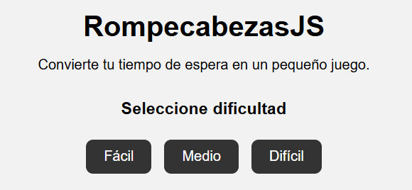
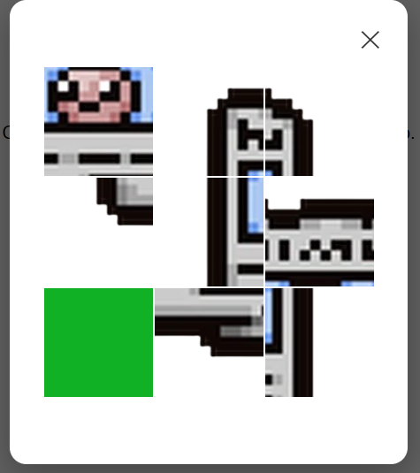
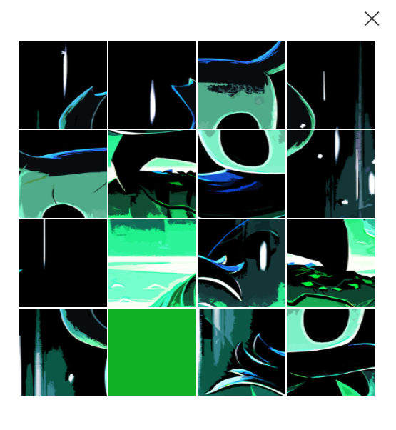
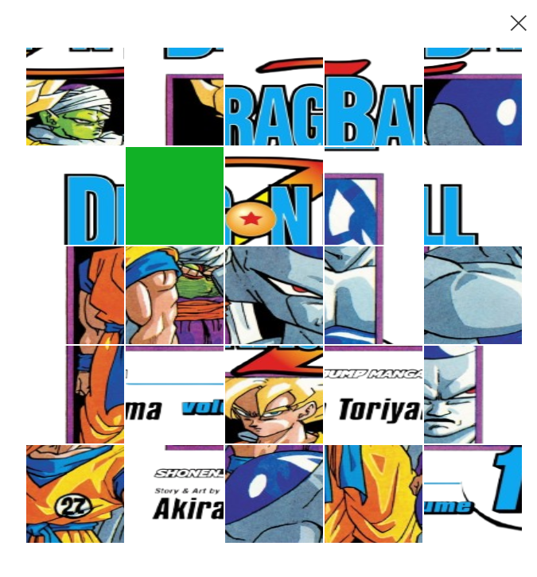
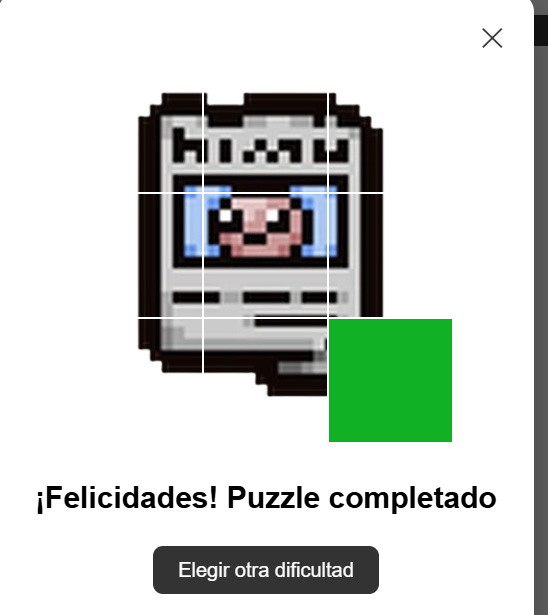

# RompecabezasJS

## Portada

**Nombre del proyecto:** RompecabezasJS
**Materia:** Programación Web
**Actividad:** Actividad 3
**Autor:** Francisco González

### Problema que resuelve

PuzzleJS es una librería de JavaScript que proporciona un rompecabezas de imágenes interactivo diseñado para entretener al usuario durante tiempos de espera.

El componente permite seleccionar diferentes niveles de dificultad y genera automáticamente un puzzle utilizando una imagen diferente para cada nivel.

---

## Instalación

Para utilizar RompecabezasJS se deben incluir los archivos CSS y JavaScript de la librería.

### CSS

```html
<link rel="stylesheet" href="css/componente.css">
```

### JavaScript

```html
<script src="js/componente.js"></script>
```

También es necesario colocar las imágenes utilizadas por el componente dentro de la carpeta `img`.

---

## Uso

La librería utiliza la clase `PuzzleJS`, a la cual se le pueden proporcionar diferentes parámetros para crear un puzzle.

### Ejemplo

```javascript
new PuzzleJS({
    imagen: "img/imagen1.png",
    filas: 3,
    columnas: 3
});
```

Los parámetros utilizados son:

* `imagen`: ruta de la imagen que se utilizará en el rompecabezas.
* `filas`: cantidad de filas del tablero.
* `columnas`: cantidad de columnas del tablero.

### Otro ejemplo

```javascript
new PuzzleJS({
    imagen: "img/imagen2.png",
    filas: 4,
    columnas: 4
});
```

Esto genera un puzzle de 4×4 utilizando la imagen indicada.

---

## Dificultades

| Dificultad | Tamaño | Imagen      |
| ---------- | ------ | ----------- |
| Fácil      | 3×3    | imagen1.png |
| Medio      | 4×4    | imagen2.png |
| Difícil    | 5×5    | imagen3.png |

A mayor cantidad de piezas, aumenta la dificultad para completar la imagen.

---

## Funcionamiento

El usuario selecciona una dificultad desde la página principal y se crea una ventana emergente donde se muestra la imagen 
con la cantidad de piezas seleccionadas en la dificiltad.

Las piezas pueden moverse haciendo clic sobre las piezas que se encuentran junto al espacio vacío.

Cuando todas las piezas regresan a su posición original, el componente muestra un mensaje indicando que el puzzle ha sido completado y proporciona un botón para elegir otra dificultad.

---

## Capturas de pantalla

### Seleccionador de Dificiltad



### Dificultad: Facil



### Dificultad: Media



### Dificultad: Dificil



### Rompecabezas completado



---

Proyecto desarrollado para la materia de Programación Web.